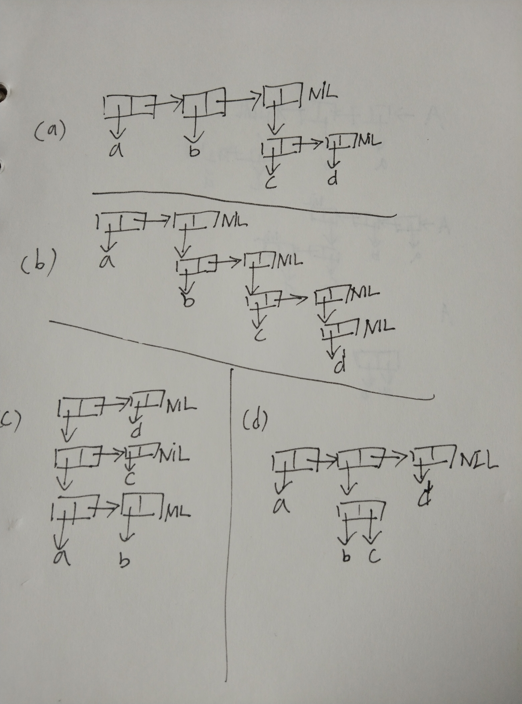

# Chapter 3 习题 (Exercises)
## 1 . 用箱子表示法表示以下列表：
* (a) (a b (c d))
* (b) (a (b (c (d))))
* (c) (((a b) c) d)
* (d) (a (b . c) d)

## 2 . 写一个保留原本列表中元素顺序的 union 版本：

                (new-union '(a b c) '(b a d))
                (A B C D)

-----------------
                (defun new-union (x y)
                    (if (null (car y))
                    x
                    (if (member (car y) x)
                    (new-union x (cdr y))
                        (progn 
                        (setf x (append x (cons (car y) ())))
                        (new-union x (cdr y))
                ))))

## 3 . 定义一个函数，接受一个列表并返回一个列表，指出相等元素出现的次数，并由最常见至最少见的排序：

                (occurrences '(a b a d a c d c a))
                ((A . 4) (C . 2) (D . 2) (B . 1))

---------------------------

                (defun occurrences (x)
                    (sort x #'string-lessp)
                    (setf x (append x (list (cons (car x) '0))))
                    (do ((tmp (car x)  (setf tmp (car x))))
                        ((listp tmp) x)
                        (if (equal tmp (caar (last x)))
                        (progn (setf (cdar (last x)) (+ 1 (cdar (last x))))
                        (setf x (cdr x)))
                        (progn (setf x (append (cdr x) 
                        (list (cons tmp '1)))))))
                    (sort x #'> :key #'cdr)
                )

## 4 . 为什么 (member '(a) '((a) (b))) 返回 nil？

*列表与符号不同 符号的地址唯一 eql会比较地址
member函数内部使用的eql 即使(eql '(a) '(a))也会返回nil*

## 5 . 假设函数 pos+ 接受一个列表并返回把每个元素加上自己的位置的列表：

                (pos+ '(7 5 1 4))
                (7 6 3 7)
使用 (a) 递归 (b) 迭代 (c) mapcar 来定义这个函数。

(a)递归
                (defun pos+ (x)
                    (setf x (reverse x))
                    (if (equal (length x) 1)
                        x
                        (progn 
                        (setf (car x) (+ (car x) (- (length x) 1)))
                        (append (pos+ (reverse (cdr x))) (list (car x))))
                    )
                )

-------------
(b)迭代
                (defun pos+ (x)
                    (do ((n (- (length x) 1) (- n 1)))
                    ((equal n 0))
                        (setf (nth n x) (+ n (nth n x)))
                    )
                    x
                )

---------------
(c)mapcar
                (defun pos+ (x)
                    (let ((i -1))
                        (mapcar #'(lambda (y) (setf y (+ y (setf i (+ i 1)) )  )) x) 
                    )      
                )

## 6 . 经过好几年的审议，政府委员会决定列表应该由 cdr 指向第一个元素，而 car 指向剩下的列表。定义符合政府版本的以下函数：

* (a) cons
* (b) list
* (c) length (for lists)
* (d) member (for lists; no keywords)
  
------------------------------------
不太理解题目意思 以后再写

## 7 . 修改图 3.6 的程序，使它使用更少 cons 核。 （提示：使用点状列表）

## 定义一个函数，接受一个列表并用点状表示法印出：

                (showdots '(a b c))
                (A . (B . (C . NIL)))
                NIL

